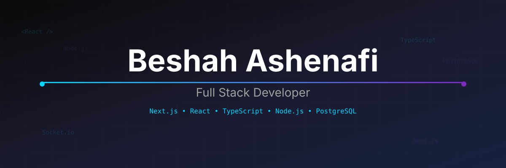

 

# BESHAH ASHENAFI

**Full Stack Developer | Problem Solver**

 

## About

Building scalable systems that solve real-world problems. Currently focused on **public transportation tech** and **real-time tracking systems**.

- **Backend**: Node.js, Express, PostgreSQL, Socket.io, REST APIs
- **Frontend**: Next.js, React, TypeScript, TailwindCSS
- **DevOps**: Docker, Vercel, Railway

 

## Featured Project

*Real-time bus tracking and scheduling system for public transport*

 

## Connect

 

*Open to collaborations and interesting projects*

